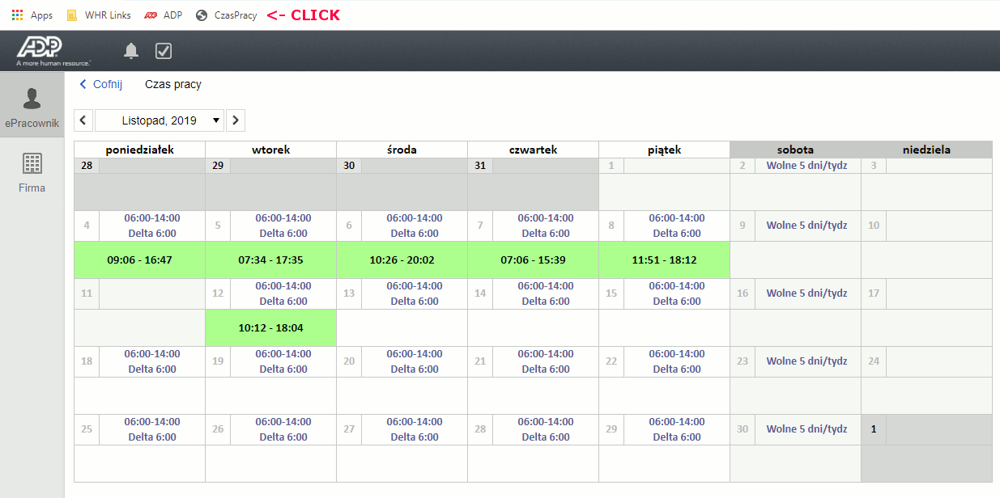

# WorkTimeCalculator

Simple snipet to summarize work time in ADP system.



# How To Use
1. Go to WebBrowser
2. Create new bookmark
3. In address input paste content of the file [Main.js](https://raw.githubusercontent.com/L0R3nz/WorkTimeCalculator/master/Main.js) with following _javascript:_

**Example**
``` javascript
javascript:var stringData = [{ Language: "pl", HourSummary: "Czas pracy", HourAvg: "Średnia" }, { Language: "en", HourSummary: "Work time", HourAvg: "Average" },];function getLanguage() { var match = document.cookie.match(new RegExp('(^| )SysLanguage=([^;]+)')); if (match) { return match[2]; } else { return "en" }}function getStringValue() { return stringData.find(element => element.Language == getLanguage());}function getMinutesFromHour(s) { if (s == null) return null; var hh = parseInt(s.split(':')[0]); var mm = parseInt(s.split(':')[1]); return ((hh * 60) + mm)}function getGetStringFromMinutes(minutes) { var retval = ""; if (minutes < 0) { minutes = -1 * minutes; retval += "-" } else if (minutes > 0) { retval += "+" } var hh = parseInt(minutes / 60); var mm = minutes - (hh * 60); if (hh < 10) retval += "0"; retval += hh; retval += ":"; if (mm < 10) retval += "0"; retval += mm; return retval;}function CalculateTime() { var TableData = []; document.querySelectorAll('[title="'+getStringValue().HourSummary+'"] > div').forEach(function(item) { if (item.innerText.indexOf("=") > 0) { item.innerText = item.innerText.substring(0, item.innerText.indexOf("=")); } var data = item.innerText.replace(/\s+/g, ''); var element = {}; if (data != null) { var enter = data.split('-')[0]; var exit = data.split('-')[1]; if ((enter == null) || (enter == "")) { element.Enter = null; element.Exit = null; element.BalanceMinutes = null; } else { element.Enter = enter; if ((exit == null) || (exit == "")) { element.Exit = new Date().toTimeString().slice(0, 5); element.BalanceMinutes = (getMinutesFromHour(element.Exit) - getMinutesFromHour(element.Enter)); } else { element.Exit = exit; element.BalanceMinutes = (getMinutesFromHour(element.Exit) - getMinutesFromHour(element.Enter)); } } item.innerText = item.innerText + "=" + getGetStringFromMinutes(element.BalanceMinutes).substring(1, getGetStringFromMinutes(element.BalanceMinutes).length); element.leftCoord = item.parentElement.offsetLeft; var skipElement = false; for (var i = TableData.length - 1; i >= 0; i--) { if (TableData[i].leftCoord == element.leftCoord) { if (TableData[i].Exit < element.Enter) { TableData[i].BalanceMinutes += element.BalanceMinutes; skipElement = true; } break; } } if (skipElement == false) { TableData.push(element); } } }); var resultMinutes = 0; var avg = 0; var divider = 0; TableData.forEach(function(element) { if (element.BalanceMinutes != null) { divider++; resultMinutes = resultMinutes + element.BalanceMinutes; } }); avg = resultMinutes / divider; resultMinutes -= 480 * divider; if (document.getElementById("worktime_summary") == null) { document.getElementsByClassName("leaflettoolbar")[0].children[1].style.width = "500px"; document.getElementsByClassName("leaflettoolbar")[0].children[1].style.fontWeight = "bold"; document.getElementsByClassName("leaflettoolbar")[0].children[1].id = "worktime_summary"; } document.getElementById("worktime_summary").innerHTML = getStringValue().HourSummary + ": ( " + getGetStringFromMinutes(resultMinutes) + " )"; console.log(getStringValue().HourSummary + ": ( " + getGetStringFromMinutes(resultMinutes) + " )"); if (resultMinutes < -60) { document.getElementById("worktime_summary").style.color = "red"; } else { if (resultMinutes > 60) { document.getElementById("worktime_summary").style.color = "green"; } else { document.getElementById("worktime_summary").style.color = "black"; } }}CalculateTime();clearInterval(handleInterval);var handleInterval = setInterval(function() { CalculateTime();}, 1000);
```

4. Login into ADP system
5. Navigate to Working Hours and click bookmark created in step 2
6. you schould see balance of hours for current time
