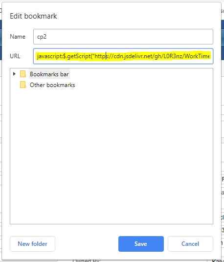

# WorkTimeCalculator 1.0.0


## List Of Features
- Calculate time as per deltas
- Calculate overall time
- Auto Update


## How To Install
1. Go to WebBrowser
2. Create new bookmark
3. Into URL address paste following data
``` 
javascript:$.getScript("https://cdn.jsdelivr.net/gh/L0R3nz/WorkTimeCalculator@master/Main.js")
```


## How To Use
1. Login into ADP system
2. Navigate to Working Hours and click bookmark created in step 2
3. You should see balance of hours for current time


## How It Works

